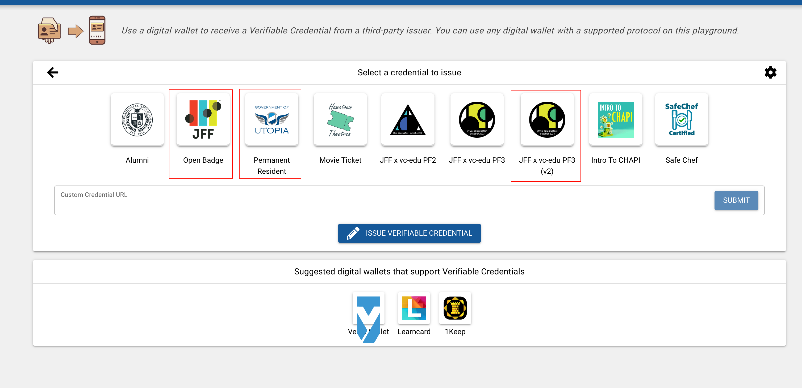

# jobspeaker-chapi-wallet-docs
This documentation describes the VC wallet developed for [Jobs For The Future Plugfest 3](https://w3c-ccg.github.io/vc-ed/plugfest-3-2023/), released on Oct 4th 2023.

A live demo is [currently available](https://wallet-worker-67guwtpfwq-uw.a.run.app/). To issue and verify credentials signed by our wallet, please login on the wallet portal and follow the instructions on the [VC-Playground website](https://vcplayground.org/) from CHAPI.

## General Specifications 

The *jobspeaker-chapi-wallet* has been bootstrapped from the CHAPI [web wallet demo](https://github.com/credential-handler/chapi-demo-wallet), with several technical requirements from JFF Plugfest 3 added on top as well as some moderate styling.

DID Authentication is supported (using `ed25519` for signatures), as well as Verifiable Presentations that include multiple VCs for the VC-Playground Verifier demo flow.

The wallet demo has been tested on the following browsers:
- Google Chrome Version 117.0.5938.132 (Official Build) (arm64)
- Google Chrome Version 117.0.5938.73 (Official Build) (arm64)
- :warning: Firefox Version 117.0.5938.132 (Official Build) (arm64) :warning: **Please note that we suggest Chrome for testing purposes.**

## Usage

### Credential Management & Login
To start the wallet demo, you need to first authorize the application to manage Verifiable Credentials for you. Visit the [live demo](https://wallet-worker-67guwtpfwq-uw.a.run.app/) and make sure you have popups enabled. A popup window will request permission to manage credentials. Afterwards, click on Login. You will be logged in as a test user called GaryLewis, and a unique DID will be generated for that wallet (stored in Web Local Storage). :warning: Note that at any point you can click the `Reset and Logout` button located on the bottom right corner of the screen to reset the entire process.

### Issuer Flow

Then, visit the [VC-playground](https://vcplayground.org) website and start with the issuer flow. We have tested issuing all of the credentials. We suggest a combination of the following three VCs:
<!--  -->

These have to be issued one by one. First click on the credential you'd like to issue and then click on `Issue Verifiable Credential`.

Select `DID Authentication` (as per JFF Plugfest 3's requirements). A screen will give you the option to authenticate with your wallet's DID and sign the credential that you'd like to issue. Once that is done, you can see the generated VC and click `Add To Wallet` to import it into your wallet.

This will open up your wallet in another tab. You can then click on the credential card to open a modal with the credential's specifications and confirm that you want it added to your wallet. After clicking `Confirm` & `Done`, you can visit your [wallet page](https://wallet-worker-67guwtpfwq-uw.a.run.app/) and examine the credential there.

### Verifier Flow
Once you have stored credentials that you'd like to verify, you can click on the Verifier Flow in the [VC-playground](https://vcplayground.org/) and start the verification process there. Select the credentials that you'd like to verify, then your wallet from the dropdown list. Then, on the wallet's page select those credentials from your current wallet's contents and click `Share`. This will generate a signed Verifiable Presentation with those credentials, and redirect you back to the VC-playground where you can see the finished VP. [A sample of that VP](vp-sample.json) is provided in this repository.

### Jobspeaker Issuing & Badge Prototypes
At one point there was a lot of focus into issuing credentials verified within the Jobspeaker platform rather than becoming a wallet provider. A sample OpenBadgeV3 Credential issued during that time from an University course verified as completed from Jobspeaker is provided [here](jobspeaker-vc-sample.json).

## Dependencies

- [vite](https://vitejs.dev/)
- [@digitalbazaar/did-method-key](https://github.com/digitalbazaar/did-method-key)
- [@digitalbazaar/ed25519-signature-2020](https://github.com/digitalbazaar/ed25519-signature-2020)
- [@digitalbazaar/ed25519-verification-key-2020](https://github.com/digitalbazaar/ed25519-verification-key-2020)
- [@digitalbazaar/security-document-loader](https://github.com/digitalbazaar/security-document-loader)
- [@digitalbazaar/vc](https://github.com/digitalbazaar/vc)
- [@digitalcredentials/security-document-loader](https://github.com/digitalcredentials/security-document-loader)
- [@digitalcredentials/vc](https://github.com/digitalcredentials/vc)

## Collaborators

Special thanks go out to:
- Ganesh Annan & Benjamin Young from Digital Bazaar, for quickly assisting us with CHAPI integration and many DID authentication hurdles
- [Diogo Queiroz](https://github.com/diogolsq) from Fetchly Labs, co-developer of this application
- Brian Richter from Aviary Technologies, who helped debug several Verifier Flow bugs (See the [1keep](https://1keep.com/) wallet in action!)
- Temitope Sonuyi from Ogun Labs for sharing nice pointers around DID Authentication
